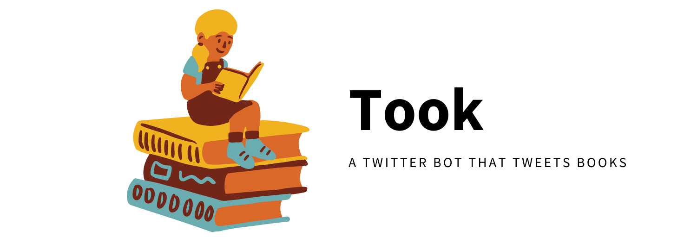

> I found myself reading more than 100 tweets per day, so why not use all that 'reading power' to read a book using tweets?   This bot was made in a day during the 25 de Mayo holiday in Argentina.

## Books tweeted 📚
- The last question by Issac Asimov **[Currently tweeting]**

## Contributing ✅
PRs and issues are always welcome. Feel free to submit any issues you have at: https://github.com/tadeodonegana/took/issues